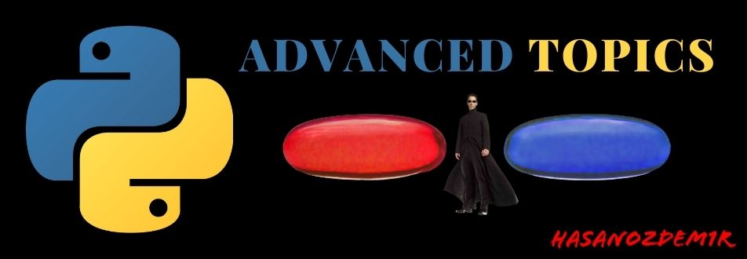

# PYTHON ADVANCED TOPICS
Comprehensive repository of advanced Python programming concepts and techniques, designed to help developers and programmers deepen their understanding and mastery of the language. The repository covers a wide range of topics, from advanced data structures and algorithms, to functional programming, concurrency and parallelism, network programming, web development, machine learning, and more.

Following topics covered in this repository

    1. API PRACTICES (Fast API, Wikipedia API)
    2. AUTOMATE BORING STUFFS (Selenium, Linkedin Automation)
    3. COMPREHENSIONS (dict, generator, list, set)
    4. COMPUTER VISION (OPENCV - FACE DETECTION)
    5. CRUD OPERATIONS (TXT,CSV,XLSX)
    6. DATA SCIENCE (PANDAS)
    7. DATA STRUCTURES & ALGORITHMS
    8. DATABASE (MYSQL, POSTRE SQL, AMAZON S3)
    9. DECORATORS 101
    10. DOCS (AWS S3 DATA INGESTION, PROJECTS EXPLAINED)
    11. FLOW CONTROL
    12. FUNCTIONS (LAMBDA, NESTED, GENERATORS, RECURSIVE)
    13. MULTITHREADING
    14. NETWORK FUNDAMENTALS (Basics, Socket API)
    15. OBJECT ORIENTED PROGRAMMING
    16. PROJECTS
    17. REGULAR EXPRESSIONS
    18. TESTING
    19. WEB SCRAPING (BS4, Requests)

## Installation
Open your terminal and write the given command for project installation to your local.
```bash
git clone https://github.com/hasanozdem1r/python_advanced_topics
```
1. For web_scraping_demo project under Web Scraping folder you must run auto_mpg.html on your localhost. There are many way for this to run html file on your localhost.
You might run this code in your terminal which is auto_mpg.html located.
```bash
python -m http.server
```
If you already installed Node.js also you can do with npm.
```bash
npm install http-server -g -> run first
http-server -> run after first line executed
```

# Software Development Considerations
While every software engineer may have their own personal preferences when it comes to development practices, it's important to follow industry best practices and standards to ensure efficient and effective software development.

Please [click](docs/standards.md) to see best practices & standards that I am following for software development

## Acknowledgements
1. İstihza Yazbel (Turkish)
2. Python Tricks by Dan Bader (English)
3. Pluralsight & Coursera (English)
4. The Hitchhiker's Guide to Python (English)

## Contributing
Pull requests are welcome.
**For major changes, please open an issue first to discuss what you would like to change.**
Please make sure to update tests as appropriate.

## License
[Massachusetts Institute of Technology](https://choosealicense.com/licenses/mit/)
